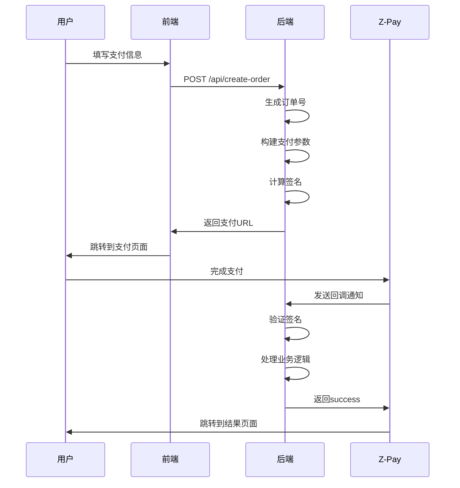

# Z-Pay支付演示系统 - 架构技术文档

## 📋 项目概述

### 项目信息
- **项目名称**: Z-Pay支付演示系统
- **版本**: v1.0.0
- **开发语言**: Node.js + JavaScript
- **部署环境**: Docker + Nginx Proxy + Let's Encrypt
- **域名**: https://zpay.satoshitech.xyz

### 项目目标
构建一个安全、可靠的第三方支付接入演示系统，展示完整的支付流程，包括订单创建、支付请求、回调验证等核心功能。

## 🏗️ 系统架构

### 整体架构图
```
┌─────────────────┐    ┌─────────────────┐    ┌─────────────────┐
│   用户浏览器     │    │   Nginx Proxy   │    │   Z-Pay网关     │
│                │    │                │    │                │
│  ┌───────────┐  │    │  ┌───────────┐  │    │  ┌───────────┐  │
│  │   前端UI   │◄─┼────┼──┤ SSL/HTTPS │  │    │  │ 支付处理   │  │
│  └───────────┘  │    │  └───────────┘  │    │  └───────────┘  │
└─────────────────┘    └─────────┬───────┘    └─────────┬───────┘
                                │                     │
                                ▼                     │
                    ┌─────────────────┐               │
                    │  Docker容器     │               │
                    │                │               │
                    │ ┌─────────────┐ │               │
                    │ │ Node.js App │ │◄──────────────┘
                    │ │             │ │  
                    │ │ ┌─────────┐ │ │  Callback
                    │ │ │ Express │ │ │  Notification
                    │ │ │ Server  │ │ │
                    │ │ └─────────┘ │ │
                    │ │ ┌─────────┐ │ │
                    │ │ │签名验证器│ │ │
                    │ │ └─────────┘ │ │
                    │ └─────────────┘ │
                    └─────────────────┘
```

### 技术栈选型

#### 后端技术栈
- **运行环境**: Node.js 18.x
- **Web框架**: Express 4.x
- **签名算法**: MD5 (utility库)
- **时间处理**: Moment.js
- **环境配置**: dotenv
- **跨域处理**: CORS

#### 前端技术栈
- **UI框架**: Material Design
- **样式**: CSS3 + Google Fonts
- **图标**: Material Icons
- **响应式**: 自适应设计

#### 运维技术栈
- **容器化**: Docker
- **反向代理**: nginx-proxy
- **SSL证书**: Let's Encrypt (acme-companion)
- **网络**: Docker网络桥接

## 🔧 核心模块设计

### 1. 签名验证模块 (ZPaySignatureValidator)

#### 模块职责
- 实现Z-Pay官方MD5签名算法
- 提供签名生成、验证、调试功能
- 处理支付请求和回调通知的签名

#### 核心方法
```javascript
class ZPaySignatureValidator {
    // 参数排序拼接 (官方算法)
    getVerifyParams(params)
    
    // 生成MD5签名
    generateSign(params)
    
    // 验证签名
    verifySign(params)
    
    // 生成支付URL
    generatePaymentUrl(paymentData)
    
    // 验证回调通知
    verifyNotify(notifyData)
    
    // 调试签名过程
    debugSign(params)
}
```

#### 签名算法实现
```javascript
/**
 * Z-Pay MD5签名算法
 * 1. 参数按ASCII码排序(a-z)
 * 2. 排除sign、sign_type、空值
 * 3. 拼接成 a=b&c=d&e=f 格式
 * 4. 末尾追加商户密钥
 * 5. MD5加密并转小写
 */
function generateSign(params) {
    const paramStr = getVerifyParams(params);
    const signStr = paramStr + this.pkey;
    return crypto.createHash('md5')
        .update(signStr, 'utf8')
        .digest('hex')
        .toLowerCase();
}
```

### 2. 支付服务模块

#### API接口设计

##### 创建支付订单
```http
POST /api/create-order
Content-Type: application/json

{
    "amount": "1.00",
    "productName": "测试商品",
    "paymentMethod": "wxpay",
    "customerName": "客户姓名",
    "customerEmail": "客户邮箱"
}
```

**响应格式:**
```json
{
    "success": true,
    "data": {
        "orderNo": "20250629095514498",
        "paymentUrl": "https://zpayz.cn/submit.php?...",
        "amount": "1.00",
        "productName": "测试商品",
        "paymentMethod": "wxpay"
    }
}
```

##### 支付回调通知
```http
POST /api/notify
Content-Type: application/x-www-form-urlencoded

pid=xxx&name=xxx&money=xxx&out_trade_no=xxx&trade_no=xxx&trade_status=TRADE_SUCCESS&sign=xxx
```

#### 业务流程设计

##### 支付流程


### 3. 配置管理模块

#### 环境变量配置
```bash
# Z-Pay商户配置
ZPAY_PID=2025062220300248
ZPAY_KEY=cQoq3mjY6v6O59AghN8bsJIIyhIdBUyn
ZPAY_GATEWAY=https://zpayz.cn/submit.php

# 服务器配置
PORT=3000
NODE_ENV=development

# 回调地址配置
NOTIFY_URL=https://zpay.satoshitech.xyz/api/notify
RETURN_URL=https://zpay.satoshitech.xyz/payment-result.html

# 网站信息
SITE_NAME=Z-Pay演示系统
```

#### 配置加载机制
```javascript
const ZPAY_CONFIG = {
    pid: process.env.ZPAY_PID || '你的pid',
    key: process.env.ZPAY_KEY || '你的key',
    gateway: process.env.ZPAY_GATEWAY || 'https://zpayz.cn/submit.php',
    notifyUrl: process.env.NOTIFY_URL || `http://localhost:${PORT}/api/notify`,
    returnUrl: process.env.RETURN_URL || `http://localhost:${PORT}/payment-result.html`,
    siteName: process.env.SITE_NAME || 'Z-Pay演示系统'
};
```

## 🔒 安全设计

### 签名安全
- **MD5签名验证**: 所有请求必须通过签名验证
- **参数完整性**: 防止参数篡改
- **重放攻击防护**: 订单号唯一性检查

### 回调安全
- **签名强制验证**: 拒绝无效签名的回调
- **状态验证**: 检查trade_status确保支付成功
- **幂等性处理**: 防止重复处理同一订单

### 网络安全
- **HTTPS强制**: 全站SSL加密
- **CORS配置**: 跨域请求控制
- **输入验证**: 参数格式和长度检查

## 🚀 部署架构

### Docker容器化
```dockerfile
FROM node:18-alpine
WORKDIR /app
COPY package*.json ./
RUN npm install --production
COPY . .
RUN mkdir -p logs
EXPOSE 3000
CMD ["npm", "start"]
```

### Nginx反向代理
```yaml
environment:
  - VIRTUAL_HOST=zpay.satoshitech.xyz
  - LETSENCRYPT_HOST=zpay.satoshitech.xyz
  - LETSENCRYPT_EMAIL=admin@satoshitech.xyz
```

### 网络架构
- **外部访问**: Cloudflare → Nginx Proxy → 应用容器
- **内部通信**: Docker bridge网络
- **SSL终端**: Let's Encrypt自动证书管理

## 📊 性能与监控

### 性能指标
- **响应时间**: < 200ms (本地处理)
- **并发处理**: Express默认并发
- **内存使用**: < 100MB (Node.js容器)

### 日志监控
```javascript
// 结构化日志
console.log('收到支付通知:', req.body);
console.log('签名验证成功，支付通知有效');
console.log(`订单 ${out_trade_no} 支付成功，金额：${money}元`);
```

### 错误处理
```javascript
try {
    // 业务逻辑
} catch (error) {
    console.error('处理失败:', error);
    res.status(500).json({
        success: false,
        message: '系统错误'
    });
}
```

## 🧪 测试策略

### 单元测试
- 签名算法测试
- 参数验证测试
- 边界条件测试

### 集成测试
- API接口测试
- 支付流程测试
- 回调验证测试

### 测试用例示例
```javascript
// 签名验证测试
const validator = new ZPaySignatureValidator(testKey);
const testParams = { /* 测试参数 */ };
const sign = validator.generateSign(testParams);
assert(validator.verifySign({...testParams, sign}));
```

## 📈 扩展性设计

### 水平扩展
- 无状态应用设计
- 支持多实例部署
- 负载均衡友好

### 功能扩展
- 支持多种支付方式
- 订单状态管理
- 数据库存储
- 商户管理系统

### 监控扩展
- 集成APM监控
- 业务指标统计
- 告警机制

## 🔧 运维指南

### 部署流程
```bash
# 1. 构建镜像
docker build -t zpay-demo .

# 2. 启动容器
docker run -d --name zpay-demo \
  -p 3000:3000 \
  --env-file .env \
  -e VIRTUAL_HOST=zpay.satoshitech.xyz \
  --network nginx-proxy \
  zpay-demo

# 3. 检查状态
docker logs zpay-demo
```

### 故障排查
1. **签名验证失败**: 检查密钥配置和参数格式
2. **回调通知异常**: 检查网络连通性和签名
3. **容器启动失败**: 检查环境变量和端口占用

### 日常维护
- 定期检查容器状态
- 监控SSL证书有效期
- 查看应用日志异常

## 📋 API文档

### 接口清单
| 接口 | 方法 | 路径 | 描述 |
|------|------|------|------|
| 创建订单 | POST | /api/create-order | 创建支付订单 |
| 支付回调 | POST | /api/notify | 处理支付通知 |
| 订单状态 | GET | /api/order-status/:orderNo | 查询订单状态 |

### 错误码定义
| 错误码 | 描述 | 解决方案 |
|--------|------|----------|
| 400 | 参数错误 | 检查请求参数 |
| 500 | 服务器错误 | 查看服务器日志 |

## 📚 参考资料

### 技术文档
- [Z-Pay官方文档](https://zpayz.cn/)
- [Express官方文档](https://expressjs.com/)
- [Docker官方文档](https://docs.docker.com/)

### 最佳实践
- RESTful API设计原则
- Node.js安全编程规范
- 微服务架构模式

---

**文档版本**: v1.0  
**最后更新**: 2025-06-29  
**维护者**: AI Assistant